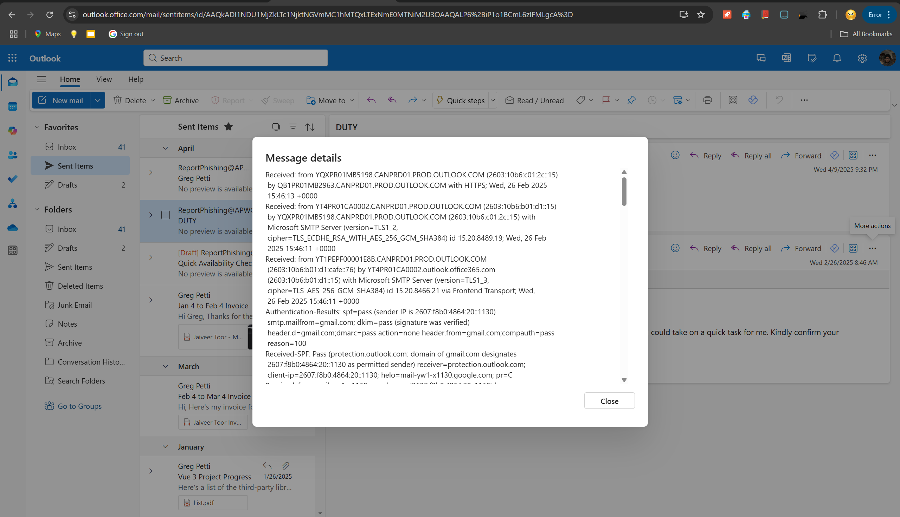

# Phishing Case Study: Boss Impersonation via Gmail

## 1. Overview

In February 2025, I received a suspicious email impersonating to be from my former supervisor, Greg Petti. The message attempted to exploit familiarity and urgency by asking if I was available and requesting my WhatsApp number.

## 2. Email Header Analysis

**From:** `Greg Petti <mydesk2405@gmail.com>`  
**To:** `jtoor@ravenblackts.com`  
**Subject:** `DUTY`  
**Date:** `Wed, 26 Feb 2025 15:45:55 +0000`  
**SPF:** Pass  
**DKIM:** Pass  
**DMARC:** Pass  

> While SPF, DKIM, and DMARC all passed, the sender domain was **Gmail**, not the official domain associated with Greg’s organization (`@ravenblackts.com`). This is a classic example of **display name spoofing**, relying on trust in the sender's name rather than the email domain.

## 3. Indicators of Compromise (IOCs)

| IOC Type        | Value                                 |
|----------------|----------------------------------------|
| Sender Email    | `mydesk2405@gmail.com`                |
| Message Subject | `DUTY`                                |
| SHA256 Hash of Email Body | `a5fc3a57542888a089587450dc67db4335d7ce2c66587fc13772165f1d40dd09` |

## 4. Social Engineering Indicators

- Authority figure impersonation (my former boss)
- Vague language to provoke curiosity
- Urgent tone asking for quick action
- Request for a personal contact number (WhatsApp)

## 5. Recommended Response Actions

- **Report** the email to internal security or SOC team
- **Block** the sender address across organizational email filters
- **Educate** users on display-name spoofing and reporting suspicious emails
- **Enable external sender warnings** in email clients (e.g., "This email came from outside your organization")

## 6. Notes

No links or attachments were included in this attempt. The attacker likely intended to continue the conversation on WhatsApp, where they could escalate the social engineering (e.g., request gift cards or confidential information).

## 7. Reporting & Action Taken

As part of my role as an **Incident Response Analyst** at CyberSecurity Sensei, I forwarded this phishing email to the **Anti-Phishing Working Group (APWG)** at:

📧 `ReportPhishing@apwg.org`

> According to CyberSecurity Sensei:  
> _"All these companies/organizations have asked us to report fraud and other suspected malicious messages. For many, their reputations are at stake, so they absolutely **do want to know** when crooks try to impersonate them, so they can put a stop to it.  
> Don't just delete those malicious emails. If you're too busy to report them, forward them to us and we'll do it on your behalf!"_  
> — CyberSecurity Sensei Incident Response Team

This helps threat intelligence teams track campaigns and protect future victims.

I forwarded the phishing email **as an attachment** to preserve full headers and metadata.

