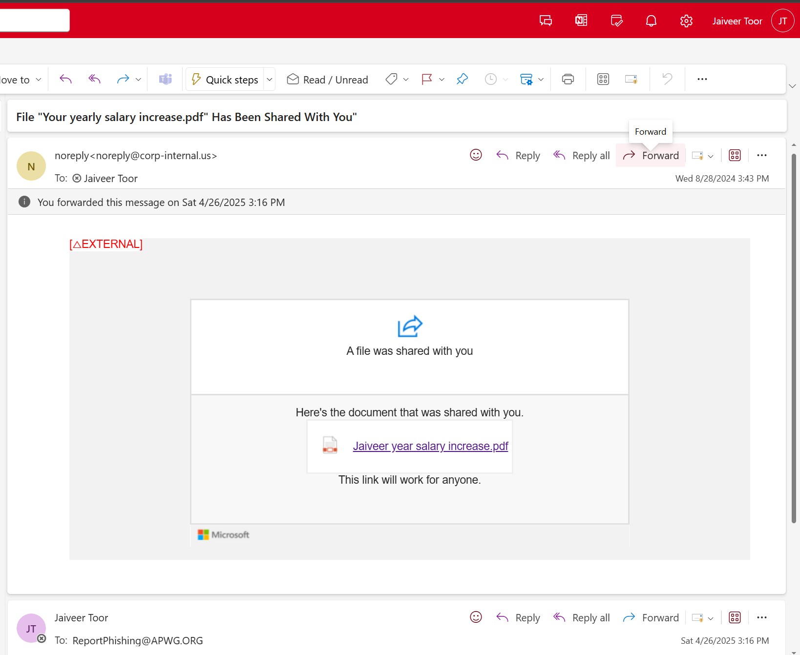

# Phishing Case Study: Fake Salary Increase PDF from “corp-internal.us”

## 1. Overview
In April 2025, I received an email on my **University of Calgary** address (`jaiveer.toor@ucalgary.ca`) with the subject:

> "File 'Your yearly salary increase.pdf' Has Been Shared With You"

The message pretended to share a document labeled as a salary update, exploiting curiosity and urgency to lure the recipient into clicking a link.

## 2. Email Header Analysis

- **Domain:** `corp-internal.us` — not affiliated with any known organization.
- **Tag:** `[△EXTERNAL]` warning was shown by the mail server.
- **Link Label:** “This link will work for anyone” — unusual for sensitive files.

## 3. Indicators of Compromise (IOCs)

| IOC Type              | Value                                                      |
|-----------------------|------------------------------------------------------------|
| Sender Email          | noreply@corp-internal.us                                   |
| Subject               | File "Your yearly salary increase.pdf"                     |
| Link Target (Inactive)| Unknown (HTTP 404 page)                                    |
| File Name             | Jaiveer year salary increase.pdf                           |

## 4. Social Engineering Indicators

- **Curiosity bait**: mentions a salary increase.
- **Urgency**: implied immediate action.
- **Personalization**: uses my name in file title.
- **Impersonation**: mimics internal IT file share format.

## 5. Recommended Response Actions

- Report phishing to internal IT team.
- Block `corp-internal.us` domain.
- Educate users about curiosity-based phishing.
- Enable link scanning and sandboxing where possible.

## 6. Notes

The phishing link was inactive at the time of analysis (HTTP 404 error). This may mean:
- The phishing site was taken down quickly.
- The campaign was part of a limited window.
- The attacker was testing delivery and engagement rates.

## 7. Reporting & Action Taken

- Forwarded the phishing email as an attachment to:
  - 📧 `ReportPhishing@apwg.org`
- Shared with CyberSecurity Sensei Incident Response Team for record-keeping.
- No link clicked — incident reported before compromise.

